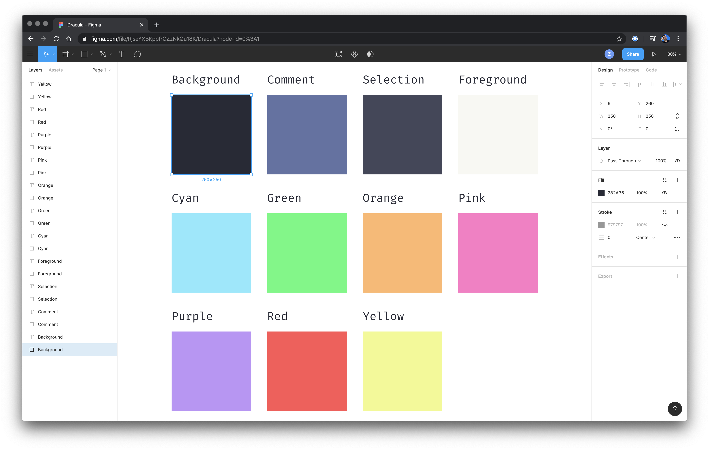

# Dracula for [Figma](https://www.figma.com)

> A dark theme for [Figma](https://www.figma.com).

## Install
Click the Duplicate button to add a copy to your Account. [Figma file](https://www.figma.com/community/file/827217601138736976/Dracula-Colors).
More information can be found at [draculatheme.com/figma](https://draculatheme.com/figma).

## Team

This theme is maintained by the following person(s) and a bunch of [awesome contributors](https://github.com/dracula/figma/graphs/contributors).

 | 
--- | ---
[Zeno Rocha](https://github.com/zenorocha) | [Tuxu](https://github.com/Tuxxu)

## License

[MIT License](./LICENSE)
